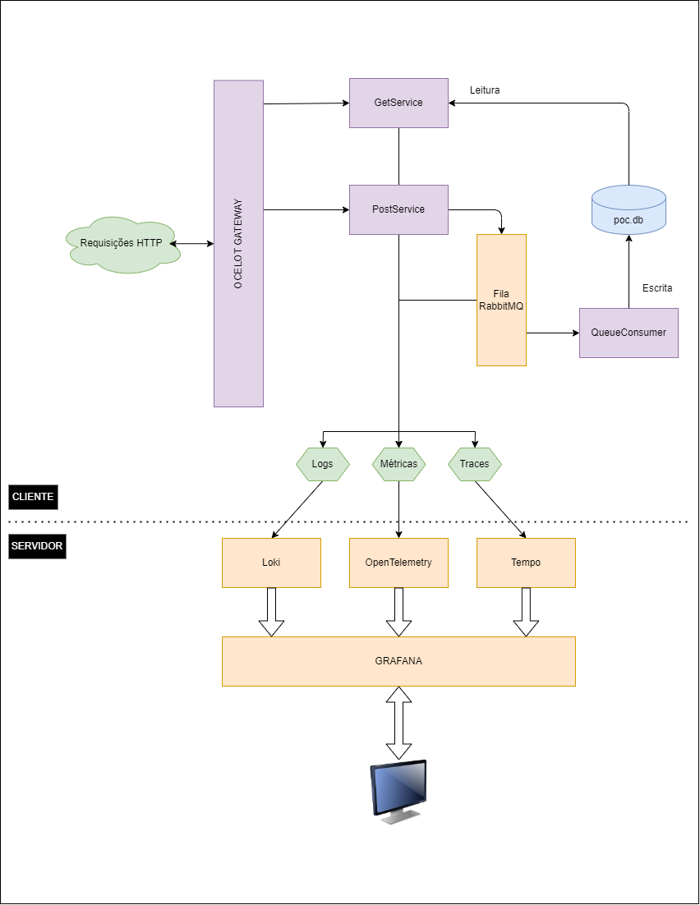
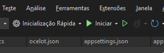

# Prova de conceito: Ocelot, ASP.NET & OpenTelemetry

## Objetivo :1st_place_medal:
O objetivo dessa demonstração é disponibilizar um esboço de arquitetura para a refatoração do projeto "WebApiGateway", presente na solução "AutoLabSolution".
Esse esboço conta com dois elementos principais: Uma stack de observabilidade e um Gateway de API.

### API Gateway :door:
Um gateway (do português, porta de entrada) é um programa que faz basicamente uma coisa: Redireciona requisições para outros programas. Usar um gateway, no nosso contexto (REST API's), torna-se interessante pois com ele podemos unificar aspectos como autenticação, rate-limits, etc. Só depois de validarmos uma requisição no Gateway, mandamos ela para os serviços em si. Esses serviços, portanto, podem ficar totalmente isolados e não precisam se preocupar com muitos aspectos de segurança que antes precisariam ser levados em conta.

Para essa demonstração, usaremos uma solução muito sólida para criar um gateway em C#: Ocelot. Ele é um gateway HTTP/HTTPS que pode ser facilmente configurado, via arquivos JSON. 

### Stack de Observabilidade :eye::eye:
Observabilidade é um aspecto da gestão de software, muito importante em sistemas distribuídos. Uma espécie de "meta" para as equipes de desenvolvimento. Um produto que possua boa observabilidade é muito mais previsível, fácil de gerir e de manter. Dividimos a observabilidade em três elementos: Logs, Métricas e Traces.

Existem dezenas de ferramentas para criarmos esses três pilares. Nessa demonstração, usaremos o Serilog para criar os logs dentro da aplicação, e o Loki para agregá-los. Para gerar as métricas, usaremos o Prometheus, sendo essas métricas coletadas pelo OpenTelemetry. Para criar os traces, usaremos o Tempo. Todo esse "arsenal" é agregado pelo Grafana, permitindo a sua visualização em Dashboards e gráficos.

## Estrutura do Repositório 🏗️

### Árvore de diretórios 🌳
Segue árvore da estrutura de diretórios do repositório:

```
POC_Ocelot
├─ infra
│  ├─ docker-compose.yml
│  ├─ grafana-datasources.yaml
│  ├─ otel-collector.yaml
│  ├─ prometheus.yaml
│  ├─ promtail-log
│  ├─ rabbit_definitions.json
│  ├─ tempo.yaml
│  └─ tempo_data
│     ├─ blocks
│     │  └─ tempo_cluster_seed.json
│     ├─ generator
│     │  └─ wal
│     └─ wal
│        └─ blocks
├─ POC
│  ├─ ApiGateway
│  │  ├─ ApiGateway.csproj
│  │  ├─ ApiGateway.csproj.user
│  │  ├─ ApiGateway.http
│  │  ├─ appsettings.Development.json
│  │  ├─ appsettings.json
│  │  ├─ Middleware
│  │  │  └─ InterceptionMiddleware.cs
│  │  ├─ ocelot.json
│  │  ├─ Program.cs
│  │  └─ Properties
│  │     └─ launchSettings.json
│  ├─ GetService
│  │  ├─ appsettings.Development.json
│  │  ├─ appsettings.json
│  │  ├─ Controllers
│  │  │  └─ UserController.cs
│  │  ├─ GetService.csproj
│  │  ├─ GetService.csproj.user
│  │  ├─ GetService.http
│  │  ├─ Program.cs
│  │  ├─ Properties
│  │  │  └─ launchSettings.json
│  │  └─ User.cs
│  ├─ POC.sln
│  ├─ POC.slnLaunch.user
│  ├─ PostService
│  │  ├─ appsettings.Development.json
│  │  ├─ appsettings.json
│  │  ├─ Controllers
│  │  ├─ PostService.csproj
│  │  ├─ PostService.csproj.user
│  │  ├─ PostService.http
│  │  ├─ Program.cs
│  │  ├─ Properties
│  │  │  └─ launchSettings.json
│  │  ├─ User.cs
│  │  └─ UserController.cs
│  ├─ QueueConsumer
│  │  ├─ Program.cs
│  │  ├─ QueueConsumer.csproj
│  │  ├─ QueueConsumer.csproj.user
│  │  └─ User.cs
│  └─ SharedLibrary
│     ├─ RestrictAccessMiddleware.cs
│     └─ SharedLibrary.csproj
├─ poc.db
└─ README.md

```

## Diagrama estrutural ✏️
Segue imagem do diagrama estrutural da demonstração: 



## Banco de dados 💾
O arquivo `poc.db` é um banco de dados SQLite. Nele, temos apenas uma tabela `USERS`, que contém as colunas `IDENTIFIER INT NOT NULL`, `NAME TEXT NOT NULL` e `AGE INT NOT NULL`.

## Middleware 🔃
Uma vantagem já citada é a unificação de estratégias de segurança.

No gateway Ocelot, usamos um único *middleware* para adicionar dois cabeçalhos à requisição, que então é redirecionada. Nos serviços em si, usamos um (também único) *middleware* que é quem verifica esses cabeçalhos. A estratégia implementada é, de fato, muito simples, mas é a base de qualquer outra estratégia que possamos conceber (como JWT, Pareto, etc...).

Também poderíamos definir *middlewares* de *rate-limit*, por exemplo. Esses ficariam somente no Gateway, reduzindo a necessidade de copiarmos código e a preocupação com cada serviço individual 

## Usando o projeto 👷

### Iniciando os serviços ▶️
Essa demonstração foi concebida para ser executada em duas etapas. O primeiro passo é iniciar os containers Docker. Eles estão descritos no arquivo `/infra/docker-compose.yml`.

Para executá-los, basta digitar em um terminal `docker compose up -d`. Esse comando vai subir todos os containers responsáveis pela agregação e visualização dos Logs, Métricas e Traces (lado do cliente). São eles: Grafana, Tempo, Loki, Prometheus/Promtail e Otel-Collector. Além deles, um servidor RabbitMQ também é iniciado (esse, corresponde ao lado do cliente). 

Com esses containers "em pé", precisamos iniciar nossos projetos. Eles também poderiam ser containerizados, mas grande parte dessa "prova" consiste em utilizarmos os recursos do lado do cliente da forma mais parecida com o que hoje é o nosso próprio "WebApiGateway" no lado do cliente. Como citamos, o único processo executado via Docker do lado que seria do cliente é o servidor RabbitMQ, que é muito mais uma "firula técnica" do que qualquer outra coisa. Para iniciá-los, o ideal é usar o próprio VisualStudio e sua interface de debug. Nela foi criado um perfil de inicialização chamado "Inicialização Rápida". Ele vai iniciar todos os projetos ao mesmo tempo, em terminais distintos. Para utilizá-lo, basta escolher o perfil e clicar no ícone de "play", como no print abaixo:



Concluindo esse processo, podemos acessar o Gateway no endereço `localhost:7000`.

### Usando os Endpoints :postbox:
Nesse endereço, estão disponibilizados dois endpoints, `/api/getservice` e `/api/postservice`, simbolizando dois "micro-serviços". Cada um deles é redirecionado para o serviço equivalente (GetService/PostService).

O primeiro endpoint aceita um id na URL, algo como `http://localhost:7000/api/getservice/1`, retornando o usuário de id 1. Ele só aceita o verbo GET. Ele retorna um JSON na seguinte forma:

```json
{
    "id":1,
    "name":"Arthur",
    "age":33
}
```

Já o segundo só aceita o verbo POST, e espera a requisição com o corpo na seguinte forma: 

```json
{
    "id":1,
    "name":"Arthur",
    "birth":"09/07/1992"
}
```

Esse JSON vai diretamente pro RabbitMQ, e quem calcula a idade é o `QueueConsumer`, que em seguida escreve o novo registro no banco de dados.

*Obs.: Por se tratar de uma demonstração, não foram inseridos constraints, como primary key ou auto-incremento do id. Então você pode cadastrar usuários com o mesmo id, e eles seriam retornados na mesma request.*

## Configuração 💻

No diretório `/infra` temos 4 arquivos `.yaml` e um arquivo `.json`. O JSON corresponde às configurações do RabbitMQ, assunto que não é o objeto dessa demonstração e não será aprofundado. Dele, basta saber que define o nome da fila, suas permissões, o nome do usuário e sua senha, dados que usamos nas aplicações (PostService, o *publisher* e QueueConsumer, o consumidor dessa fila).

O arquivo mais importante para a demonstração é o `grafana-datasources.yaml`. Ele é montado como um volume no container do Grafana, e serve para definir onde estão as fontes de dados que o Grafana vai agregar.

O arquivo `prometheus.yaml` define quais são os serviços que emitem métricas, que o Prometheus também "agrega" de certa forma. Ele é montado como um volume no container correspondente.

O arquivo `tempo.yaml` define de onde o container captura os traces, como eles são salvos e por quanto tempo são mantidos. Ele também é montado como um volume no container do Grafana Tempo.

O arquivo `otel-collector.yaml` define como serão coletadas as métricas e traces. Ele é montado como um volume no container `otel-collector`.

Dentro dessa pasta `/infra` são criados alguns diretórios, que contém logs e dados de cada container, para debug.

## Próximos passos 🚵

### API Gateway 🚪
Nosso projeto "WebApiGateway" está em um formato que não é nem uma API "pura" nem um Gateway "completo". Ele deve ser refatorado, de forma que seus endpoints fiquem "por trás" de um gateway de fato. Assim, conseguiríamos unificar estratégias de segurança, *rate-limit*, etc.

Esse padrão proposto é o que chamamos de "API Gateway Pattern", e é talvez o mais utilizado em micro-serviços, principalmente quando a comunicação entre esses serviços é via HTTP/HTTPS.

Para implementá-lo no nosso projeto, precisamos de algumas definições, como quais serão os serviços que "esconderemos" atrás do Gateway (Separaríamos os endpoints segundo seu domínio? Manteríamos todos juntos e só adicionamos uma camada a mais ao projeto?). 

A escolha mais simples seria usarmos o Ocelot como gateway e separamos os streams por domínio.

### Stack de Observabilidade :eye::eye:

#### Logs 📄
Hoje, não temos praticamente nenhuma observabilidade implementada no projeto. Os logs são salvos como arquivos "soltos" no diretório da aplicação, e quem precisa deles geralmente não tem acesso direto. Esses arquivos são isolados e ninguém consegue ter uma visão "geral" de como as aplicações (distribuídas em dezenas de clientes) estão de fato se comportando.

Usar algo como Loki/Grafana vai permitir que os logs sejam acessados por nós com muito mais segurança (não precisaríamos de acesso remoto total à maquina do cliente), em tempo real e possivelmente de forma "totalizada", com informações sobre a quantidade desses logs, sua natureza, etc. Além disso, poderíamos facilmente gerar "agregações" de diversos clientes, para checar aspectos gerais da aplicação (como os clientes do Multicultivo se comportam vs o do Solos, por exemplo).

Nossa vantagem é que todos os logs já são escritos com Serilog e salvos a partir de "Sinks". Isso facilitaria muito a utilização do Grafana.

#### Métricas 📏
Nossa aplicação não emite nenhuma métrica em ambiente de produção. Não sabemos quantas conexões de banco são usadas em cada cliente, ou quanta memória nossa aplicação usa.

Nesse sentido, usar o Prometheus com o Otel-Collector pode nos ajudar a observar gargalos que, em desenvolvimento, jamais seriam observados.

#### Traces :alarm_clock:
Não geramos nenhum trace da aplicação. Traces são as "conexões" entre as métricas e os eventos da aplicação. Com eles, poderíamos enxergar quanto tempo uma tela específica demora pra carregar, ou quanto tempo uma ordem de análise fica "viva" na aplicação, desde seu registro até seu resultado. As possibilidades são infinitas!

Portanto, usar uma ferramenta como o Tempo, em conjunto com o Grafana, pode nos dar não só uma visão mais prática dos gargalos que as métricas nos mostraram, mas até mesmo *insights* de produto e usabilidade (quais rotas/telas são menos acessadas, por exemplo).